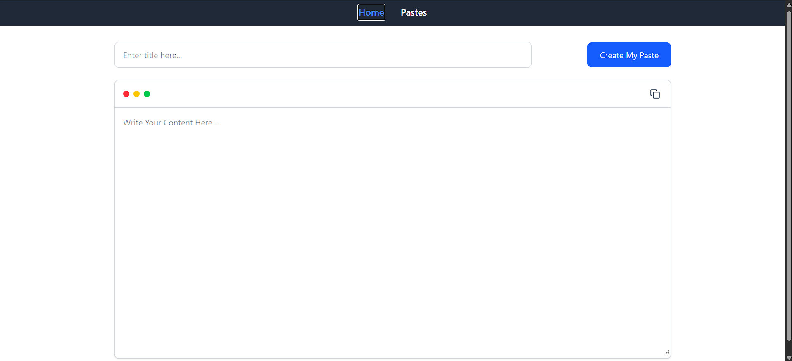
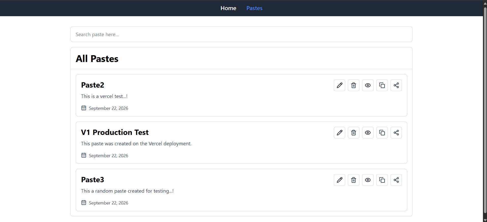
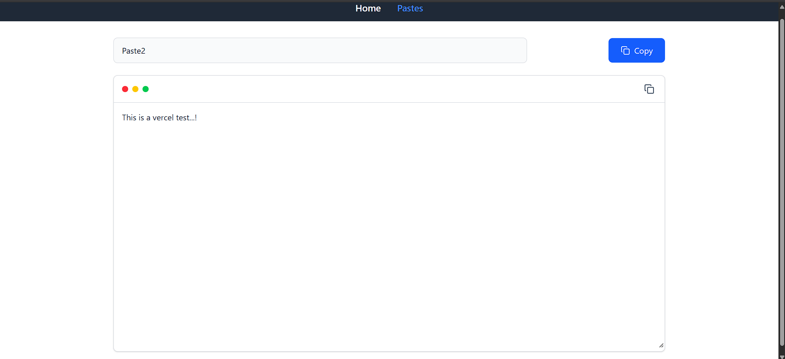

# 📋 Paste App

A modern and responsive Paste App built with React that allows users to create, manage, search, edit, delete, copy and share text/code snippets.

This project was initially built while learning React and was enhanced with additional features, improved UI, duplicate prevention, browser sharing and production deployment.

## 🚀 Live Demo

🔗 https://paste-app-topaz-nine.vercel.app/

## 📂 GitHub Repository

🔗 https://github.com/gharish7k/PasteApp

---

## ✨ Features

- 📝 Create new pastes
- ✏️ Edit existing pastes
- 👁️ View individual pastes
- 🗑️ Delete pastes
- 🔍 Search and filter pastes
- 📋 Copy paste content
- 🔗 Share paste URLs using the Web Share API
- 🚫 Duplicate paste prevention
- 💾 Persistent data using LocalStorage
- 🔔 Toast notifications
- 📅 Automatic creation date display
- 📱 Responsive user interface
- 🧭 Client-side routing with React Router
- ⚡ Fast and optimized production build
- ☁️ Deployed on Vercel

---

## 🛠️ Tech Stack

### Frontend

- React
- JavaScript
- Tailwind CSS
- React Router
- Redux Toolkit
- Lucide React

### Browser APIs

- LocalStorage API
- Clipboard API
- Web Share API

### Development & Deployment

- Vite
- Git
- GitHub
- Vercel

---

## 🏗️ Project Structure

```text
src/
│
├── components/
│   ├── Home.jsx
│   ├── Navbar.jsx
│   ├── Paste.jsx
│   └── ViewPaste.jsx
│
├── redux/
│   └── pasteSlice.js
│
├── App.jsx
├── App.css
├── index.css
├── main.jsx
└── store.js
```

## 🔄 Application Flow

```text
             ┌─────────────────┐
             │    Home Page    │
             └────────┬────────┘
                      │
                      ▼
             ┌─────────────────┐
             │ Create a Paste  │
             └────────┬────────┘
                      │
                      ▼
             ┌─────────────────┐
             │   LocalStorage  │
             └────────┬────────┘
                      │
                      ▼
             ┌─────────────────┐
             │   Pastes Page   │
             └───────┬─────────┘
                     │
          ┌──────────┼───────────┐
          ▼          ▼           ▼
       Edit       View/Delete   Share
          │          │           │
          └──────────┴───────────┘
```

## 🎯 Key Features Explained

### 🔍 Search

Users can search through their saved pastes using the search bar. Results are dynamically filtered based on the paste title.

### 🚫 Duplicate Prevention

The application prevents users from creating an identical paste by comparing both the title and content of existing pastes.

### 📋 Copy

Paste content can be copied directly to the clipboard using the browser Clipboard API.

### 🔗 Share

The application uses the browser's Web Share API when available.

If Web Share API is unavailable, the paste URL is copied to the clipboard as a fallback.

### 💾 LocalStorage

Pastes are stored in the browser's LocalStorage, allowing data to remain available after refreshing the page.

### 🧭 Routing

React Router is used for navigation between:

```text
/
├── Home
│
├── /pastes
│   └── All Pastes
│
└── /pastes/:id
    └── View Individual Paste
```

## 📸 Screenshots

### 🏠 Home Page



### 📋 All Pastes



### 👁️ View Paste



## ⚙️ Installation & Setup

### 1. Clone the repository

```bash
git clone https://github.com/gharish7k/PasteApp.git
```

### 2. Navigate into the project

```bash
cd PasteApp/paste-app
```

### 3. Install dependencies

```bash
npm install
```

### 4. Start the development server

```bash
npm run dev
```

The application will be available at:

```text
http://localhost:5173
```

## 📦 Production Build

To create a production build:

```bash
npm run build
```

To preview the production build locally:

```bash
npm run preview
```

## 🌐 Deployment

The application is deployed using Vercel.

Production URL:

https://paste-app-topaz-nine.vercel.app/

A Vercel rewrite configuration is included to support client-side React Router navigation and direct access to dynamic paste URLs.

## 🔮 Future Improvements — V2

The current version uses LocalStorage for data persistence.

Future development will introduce a backend architecture:

```text
React Frontend
      │
      ▼
Node.js + Express
      │
      ▼
MongoDB
      │
      ▼
Cloud Database
```

Planned V2 features:

- 🌍 Cross-device paste sharing
- ☁️ Cloud-based storage
- 🔐 User authentication
- 👤 User-specific pastes
- 🔗 Permanent shareable URLs
- ⏳ Paste expiration
- 🔒 Private/public pastes
- 📊 Paste analytics
- 🛡️ Backend validation
- 🚀 REST API

## 📚 Learning Outcomes

Through this project, I practiced:

- React component development
- React Hooks
- State management with Redux Toolkit
- React Router
- CRUD operations
- LocalStorage
- Browser APIs
- Responsive UI development
- Form handling
- Error handling
- Git & GitHub workflow
- Production builds
- Vercel deployment

## 👨‍💻 Author

### G. Harish Kumar

B.Tech – Computer Science and Engineering

Sri Indu College of Engineering and Technology

GitHub:

https://github.com/gharish7k

## ⭐ Support

If you found this project useful or interesting, consider giving the repository a ⭐ on GitHub.